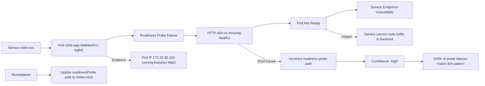

# c056 readiness probe points to a missing health endpoint, so endpoints are not ready

## Case

- Category: service-readiness
- Difficulty: medium
- Noise: no
- Namespace: siclaw-eval-yye-20260602
- Targets: deployment/c056-app, service/c056-svc
- Symptom: Internal service c056-svc for workload c056-app is unavailable to clients.
- Ground truth localization: deployment/c056-app
- Ground truth mechanism: readiness probe points to a missing health endpoint, so endpoints are not ready
- Ground truth scope: one service path in the eval namespace

## Judgment

- Status: completed
- Passed: yes
- Total score: 0.817
- localization: 1.000 (deployment/c056-app)
- mechanism: 0.965 (readiness, probe, points, missing, health, endpoint, endpoints, not, ready, service)
- scope: 0.200 (path)
- evidence: 0.650 (deployment readiness, endpoints/endpointslices)
- remediation: 1.000 (remediation, correct, update)

## Agent Input

```text
You are Siclaw under evaluation as a read-only SRE diagnostic agent.

Incident:
Internal service c056-svc for workload c056-app is unavailable to clients.

Target cluster: cks-test
Namespace: siclaw-eval-yye-20260602
Primary target resource(s): deployment/c056-app, service/c056-svc
Case id: c056

Rules:
- Do not modify, delete, restart, scale, patch, or create cluster resources.
- Prefer Siclaw's relevant Kubernetes/Volcano diagnostic skills when applicable.
- Inspect only this case's resources plus minimal cluster context needed for diagnosis.
- Return a concise final diagnosis with: root cause(s), concrete evidence, impact/scope, confidence, and safe remediation suggestion.


Additional benchmark guard for this low-cost OpenAI-compatible model run:
- Do not call cluster_info in this experiment. It can return broad cluster inventory and is outside the case-local observation budget.
- Do not dump all nodes, all pods, or all events. Use namespace-scoped and target-scoped kubectl queries.
- For scheduling cases, prefer: describe the target pod, inspect its Events, inspect its nodeSelector/tolerations/affinity/resource requests, and query only matching node labels or relevant scheduler events.
- For service, network, controller, storage, and Volcano cases, inspect only the target resources and directly related owner/dependency objects in siclaw-eval-yye-20260602.
- Keep the final diagnosis concise and evidence-backed. Do not include hidden reasoning, scratchpad text, or chain-of-thought; provide only the observable diagnosis, evidence, scope, confidence, and remediation.

```

## Tool Trace

### 1. bash (11747 ms)
Args:
```json
{"command":"kubectl get service/c056-svc -n siclaw-eval-yye-20260602 -o wide","cluster":"cks-test"}
```
Result preview:
```text
NAME       TYPE        CLUSTER-IP      EXTERNAL-IP   PORT(S)   AGE   SELECTOR
c056-svc   ClusterIP   172.17.204.27   <none>        80/TCP    16h   app=c056-app
```

### 2. bash (19312 ms)
Args:
```json
{"command":"kubectl get pods -n siclaw-eval-yye-20260602 -l app=c056-app -o wide","cluster":"cks-test"}
```
Result preview:
```text
NAME                        READY   STATUS    RESTARTS   AGE   IP              NODE               NOMINATED NODE   READINESS GATES
c056-app-5b6f4b457c-dqfh6   0/1     Running   0          16h   172.16.36.194   cpu-10-208-55-85   <none>           <none>
```

### 3. bash (27742 ms)
Args:
```json
{"command":"kubectl describe pod/c056-app-5b6f4b457c-dqfh6 -n siclaw-eval-yye-20260602","cluster":"cks-test"}
```
Result preview:
```text
Name:             c056-app-5b6f4b457c-dqfh6
Namespace:        siclaw-eval-yye-20260602
Priority:         0
Service Account:  default
Node:             cpu-10-208-55-85/10.208.55.85
Start Time:       Tue, 02 Jun 2026 19:36:06 +0800
Labels:           app=c056-app
                  pod-template-hash=5b6f4b457c
                  siclaw.ai/eval-case=c056
                  siclaw.ai/eval-run=20260602
Annotations:      cni.projectcalico.org/containerID: 323b95b19bd9c3165f08af8c39f8464d62119a692a813b413cd70928f0a62b1a
                  cni.projectcalico.org/podIP: 172.16.36.194/32
                  cni.projectcalico.org/podIPs: 172.16.36.194/32
Status:           Running
IP:               172.16.36.194
IPs:
  IP:           172.16.36.194
Controlled By:  ReplicaSet/c056-app-5b6f4b457c
Containers:
  http:
    Container ID:  containerd://2d0c25c67f09b2f967b61b83d5a2c93bb1794fa49b7a08353534cc258b92b369
    Image:         busybox:1.36
    Image ID:      docker.io/library/busybox@sha256:73aaf090f3d85aa34ee199857f03fa3a95c8ede2ffd4cc2cdb5b94e566b11662
    Port:          8080/TCP
    Host Port:     0/TCP
    Command:
      sh
      -c
      mkdir -p /www && echo ok >/www/index.html && httpd -f -p 8080 -h /www
    State:          Running
      Started:      Tue, 02 Jun 2026 19:36:07 +0800
    Ready:          False
    Restart Count:  0
    Readiness:      http-get http://:8080/missing-healthz delay=1s timeout=1s period=3s #success=1 #failure=3
    Environment:    <none>
    Mounts:
      /var/run/secrets/kubernetes.io/serviceaccount from kube-api-access-zqx8k (ro)
Conditions:
  Type                        Status
  PodReadyToStartContainers   True 
  Initialized                 True 
  Ready                       False 
  ContainersReady             False 
  PodScheduled                True 
Volumes:
  kube-api-access-zqx8k:
    Type:                    Projected (a volume that contains injected data from multiple sources)
    TokenExpirationSeconds: **REDACTED**
    ConfigMapName:           kube-root-ca.crt
    Optional:                false
    DownwardAPI:             true
QoS Class:                   BestEffort
Node-Selectors:              <none>
Tolerations:                 node.kubernetes.io/not-ready:NoExecute op=Exists for 300s
                             node.kubernetes.io/unreachable:NoExecute op=Exists for 300s
Events:
  Type     Reason     Age                   From     Message
  ----     ------     ----                  ----     -------
  Warning  Unhealthy  3s 
```

## Agent Output

```markdown

```
